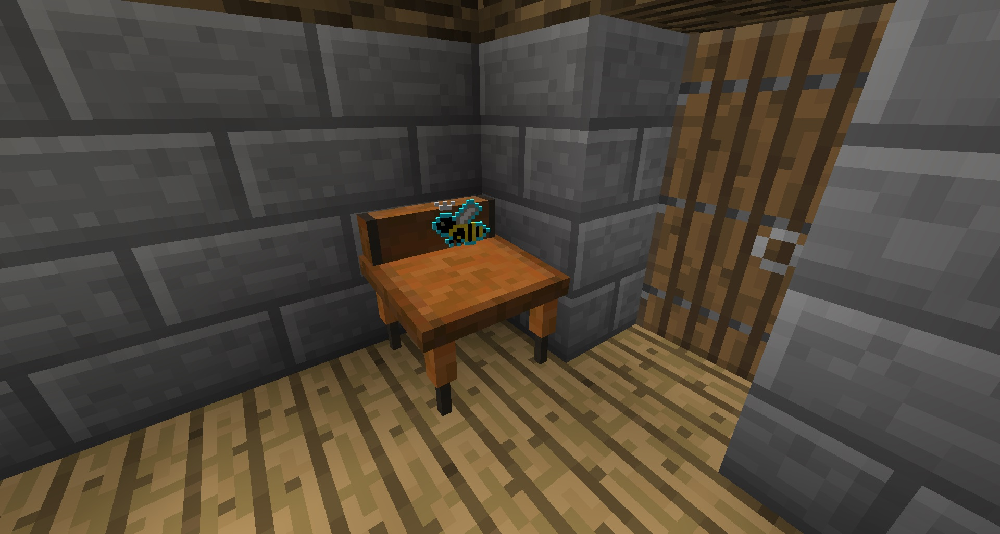

Minigames? In Forestry? It's more likely than you think. 

The Escritoire is a valuable, if somewhat difficult to type block, that allows you to play a matching minigame. Place a Drone into the middle slot, and then select a book tile to reveal a bee species. Select another tile, and if those two match, you continue the game. If you manage to successfully match all species without making a single mistake, you win. If you lose, you can pick up your Drone, place it back and try again.

The far left slots are where you place Drones or products to get hints. Place them, then click the microscope button. The number of Drones or products used will determine how many tiles are revealed. The Drones or products are always used up, however. 

Why should you care? If you successfully win, you might be rewarded with the bee’s (from the center) product, the bee’s specialty product or (more importantly) research notes. When used, research notes will give a permanent 5 percent bonus to bee crossbreeding of the particular combination the notes affect. While it does give 5 percent, it is only effective up to 1.5x the normal mutation rate. For example, a bee mutation that is normally 10 percent will now permanently be 15 percent, but if the combination in the notes is 2 percent naturally then the bonus will only increase it to 3 percent.

Using hints will lower your chances of getting rewards from winning.