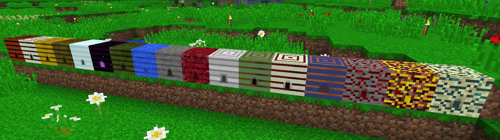

When wandering around in your world you will no doubt notice the various different types of Bee Hives scattered throughout different Biomes and even underground or underwater. These are Bee Hives. They contain bees, and if you get too close to some of these, you will get stung and take a little bit of Damage. Some bees do direct damage to you, and others poison you. 

Some bees do not stack because they have different attributes (we will cover this in more detail later).

When you hover over bees you will notice that each says “Unknown.” This is normal when first starting out, and each new bee you get in the future will also say this. You will learn more about these bees later.

So what else can bees do? Well, apart from give you Delicious Honey Bread, they can also give you:
* Resources
* Protection
* Status Effects
* Automation
* Animal Breeding

**Mundane Bees**

|Species        | Origin           | Special Notes           | Produce                     |
|-------------- | ---------------- | ----------------------- | --------------------------- |
|Forest Bee     | Forest Hive      | Requires Normal Flowers | Honey Comb                  |
|Meadows Bee    | Meadows Hive     | Requires Normal Flowers | Honey Comb                  |
|Modest Bee     | Desert Hive      | Requires Cacti          | Parched Comb                |
|Tropical Bee   | Jungle Hive      | Requires Fern or Vine   | Silky Comb                  |
|Wintry Bee     | Snow Hive        | Requires Normal Flowers | Frozen Comb                 |
|Marshy Bee     | Swamp Hive       | Requires Mushroom       | Mossy Comb                  |
|Water Bee      | Water Hive       | Requires Lily Pad       | Wet Comb                    |
|Rocky Bee      | Rock Hive        | Requires Stone          | Rocky Comb                  |
|Embittered Bee | Nether Hive      | Requires Nether Wart    | Simmering Comb              |
|Marbled Bee    | Marble Hive      | Requires Normal Flowers | Honey Comb                  |
|Valiant Bee    | Valiant Any Hive | Any bee from a wild hive has a 5% chance of being Valiant | Cocoa Comb, Sugar |
|Ender Bee      | End Hive         | Requires Dragon Egg     | Mysterious Comb             |
|Mystical Bee   | Curious Hive     | Requires Normal Flowers | Mundane Comb                |
|Unusual Bee    | Unusual Hive     | Requires Normal Flowers | Mundane Comb                |
|Sorcerous Bee  | Resonating Hive  | Requires Normal Flowers | Mundane Comb                |
|Attuned Bee    | Deep Hive        | Requires Normal Flowers | Mundane Comb                |
|Infernal Bee   | Infernal Hive    | Nether Wart             | Molten Comb, Glowstone      |
|Oblivion Bee   | Oblivion Hive    | Chorus                  | Forgotten Comb, Ender Pearl |

<!---
I hate Tables
-->

There are a total of 12 Mundane Hives (a Bee Species you can find in a hive depending on your mod pack), and each drops its own type of Bee and Honey. Each spawns in a different Area.
Honey comes from Combs and is used in the Portable Analyzer. It will help you identify Bees and help you choose what Bees to Breed or to throw away. It's the tool you will be using more than anything in the early stages of Bee Breeding. 

The Portable Analyzer tells you the Flowers, Temperature, LifeSpan, Offspring and much more about each bee that you scan. Think of it as a way to know everything about a Bee. More details about the Portable Analyzer later.

So where can all these hives be found?

* Meadows Hives - Forests, Forested Hills, Birch Forest, Pine Forest
* Forest Hive - Forest, Autumn Woods, Forested Hills, Birch Forest, Pine Forest
* Modest Hive - Desert, Mountain Desert
* Tropical Hive - Rainforest, Extreme Jungle, Mini Jungle, Jungle
* Wintry Hive - Taiga, Mountain Taiga, Snowy Rainforest, Snow Forest, Tundra, Ice Plains, Ice Mountains
* Ender Hive - The End
* Marshy Hive - Swampland, Green Swamplands, Redwood Lush, Rainforest, Green Hills, Marsh, River
* Water Hive - Any Underwater - River, Ocean most common but other biomes with water are possible
* Rock Hive - Any Overworld underground
* Nether Hive - The Nether
* Marble Hive - In all biomes, including the Twilight Forest, with the Extra Bees mod.
* Unusual Hive - Jungle and Plains
* Curious Hive - Forest and Plains
* Resonating Hive - Desert
* Deep Hive - Mountains, Extreme Hills, Ominous Woods
* Infernal Hive - Nether, below layer 14 under certain Overworld biomes of BoP (like Ominous Woods and Mystic Grove) encased in Glowstone.
* Oblivion Hive - The End - On the underside of the main island, on the top-side of the Obsidian pillars, below layer 12 under certain Overworld biomes of BoP (like Ominous Woods, Mystic Grove) encased in Endstone.

