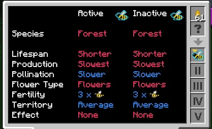

The Portable Analyzer is one of the most important tools when trying to breed bees. It tells you everything you need to know about your Queen/Drone/Princess. It can tell you what flowers your queen needs and what type of byproducts you can expect. It will help you troubleshoot all your problems when it comes to bees.

The Analyzer is also used for butterflies and trees.

It’s best to craft one of these as soon as possible. It costs a diamond, but like I said, it will make the breeding process a lot quicker. Without it, you will just be guessing your way through bees since JEI does not give you all the details.

To use the Portable Analyzer you need to use Honey. You can get this from combs. The important thing to note is that each time you want to analyze a bee (or a tree or butterfly) you will consume one honey. So make sure you have enough on hand. If you are having trouble with honey, you can always use a bee house with a forest queen. This will give you a steady supply of honey.

When you open the Portable Analyzer, you will be greeted with a screen, with information in the middle and 7 slots on the right. The top slot is where you insert honey, and the slot below it is where you put your bee. As soon as the bee is put into the second slot, it will drop down one slot (to slot I). You can then move the bee down each slot to find out more information:

Each slot on the right will give you different information about the Bee.

The Beealyzer GUI is divided into 3 main sections:

* Slot I - General Information:
	* Species - type (Forest, Meadows, etc).
	* Lifespan - how long a Queen will live/work before producing the next generation.
	* Production - how quickly a Queen will produce combs or other goods.
	* Pollin (Pollination) - how quickly the bees will encourage their particular flower to grow, and also how quickly the bees will affect nearby trees for Arboriculture.
	* Flowers - The accepted variety of “flowers” the bees require to work. Most bees will use the red or yellow flowers found in Minecraft, though other types may use Cacti, or other types of plants…
	* Fertility - How many Drones the Queen will spawn when reproducing (a Princess is always produced).
	* Area - X, Y and Z dimensions (centred on the apiary or alveary) of the bees' territory. They search only within their territory for flowers, and may have an effect within it.
	* Effect - What effect (if any) the bees produce within their territory.

