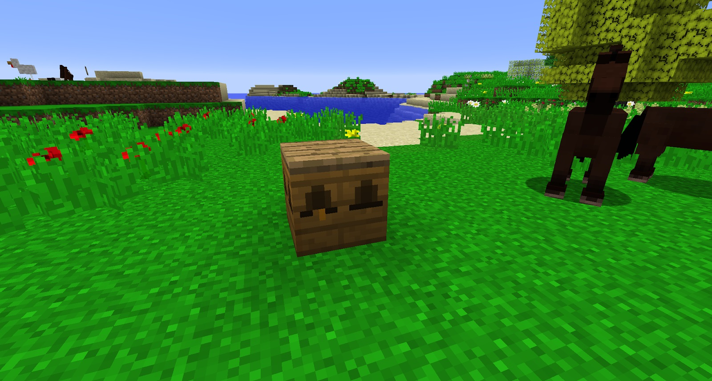
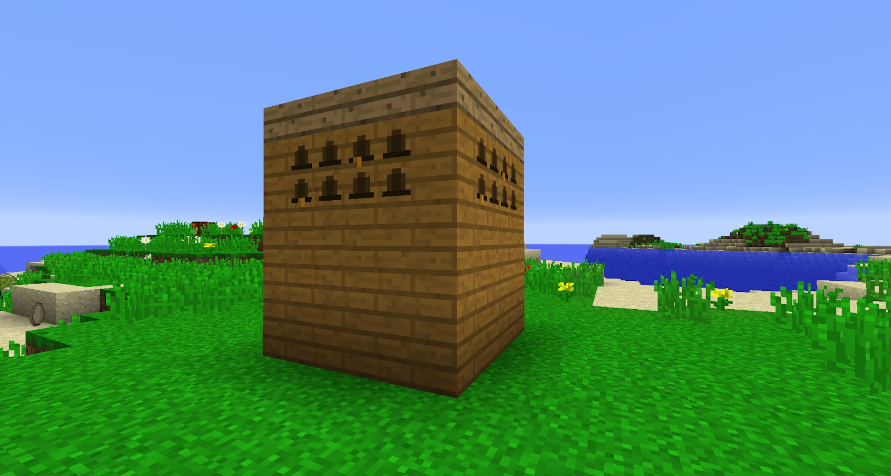

For bees to produce you need to make them someplace to live. Vanilla Forestry provides 3 types of Bee Housing, while Magic Bees and Gendustry provide alternatives, if they are available to you.

**Bee House** - The most basic kind of bee house. This is the simplest bee house you can build, just requiring some wood and a honeycomb. While it cannot be automated, and provides a very minimal return, it boasts a boost to the pollination rate of nearby trees. The Bee House has a niche use in bee breeding, as bees inside cannot mutate to new species, and is thus helpful to stabilize species of bee (for example: the Common species, preventing accidental mutation to Cultivated). Note that villagers will replace bees when they die in beehouses. This is what you will use early on to get a bit of honey and spare drones. Bee Houses increase bee’s life cycles at the cost of production rate. If you can't automate apiaries for honey/drones then keep using Bee Houses since they are lower maintenance.

**Apiary** - The standard bee house. A little more complex to make than the Bee House, requiring a carpenter and squeezer, along with wood and seed oil. You can also snag these from villages and Beekeeper villagers (they have yellow honey-like robes) and sometimes offer you a trade of wood for apiaries. Unlike Bee Houses, they can be automated and allow for mutation. They have a higher yield of produce than the Bee House. They can also accept Frames, although these cannot be automated.

**Alveary -** The top-tier bee house in vanilla Forestry. The most basic alveary is formed of 27 alveary blocks, with 9 wooden slabs of any kind on top. You'll know it has formed correctly when markings appear in the middle, top block of each side. Each of the exterior blocks, aside from the middle, top block of each side, can be replaced with a more advanced alveary block. The Basic alveary blocks require Pollen Clusters from Industrial Bees, Royal Jelly from Imperial Bees, plenty of wood, some honey and seed oil. The advanced blocks need Electron Tubes made in the Thermionic Fabricator.

* Alveary Fan - When provided with RF power, reduces the Alveary’s temperature.
* Alveary Heater - Essentially the opposite of the fan, this heats the alveary instead.
* Alveary Hydro Regulator - Give it water to make the alveary more humid (and slightly colder) or lava to make it less humid (and slightly hotter).
* Alveary Sieve - An interesting upgrade for sure, give it silk mesh as a filter, and any pollen collected by the bees will end up in the sieve instead of on a tree, allowing for more controlled tree breeding.
* Frame Housing (ExB) - Allows you to place a single frame within the Alveary. Frames affect the bees inside the same way as in an Apiary.
* Mutator (ExB) - Certain Mutating items can be placed inside to increase the chances of mutation. Be warned, this can also damage the bee.

There are a few other bee houses, but these will be covered later when we can fully automate bee breeding. You can use bee houses for a bit of honey/drones early without a chance for uncontrolled mutations. Move on to Apiaries once you feel comfortable.
