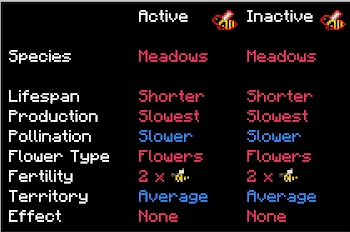

Before you start breeding bees, you should quickly review traits. Using the Portable Analyzer,  you can see what traits each bee carries. This enables you to breed bees with specific traits.

When dropping a bee into the Portable Analyzer, you'll be given genetic information about the bee. Blue traits are Recessive and Red ones are dominant. In most cases, the trait that affects the bee are the active ones, on the left. The only exception to this is if the active trait is Blue (recessive) and the inactive trait is Red (dominant), in which case the dominant trait will override the Recessive one, even though it's in the inactive trait.

This mostly comes into purifying traits (especially fertility) via crossbreeding. If you’re just mutating, the species traits (Meadows - Meadows in the above image) are all you need to worry about, aside from the temperature and humidity information you can find by moving the identified bee onto the III section.