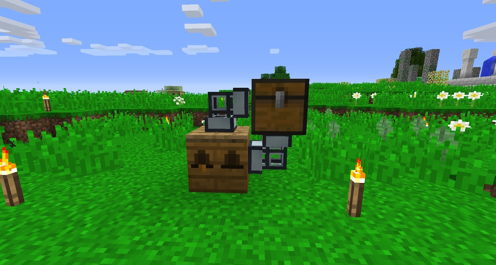
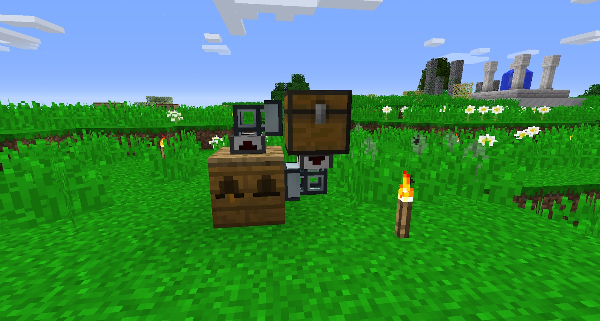
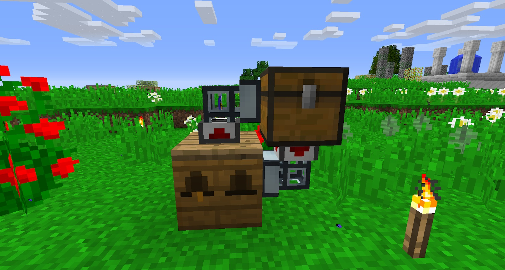

The breeding process is the same for all other bees. This is the slow way of doing it, but speeding it up will require lots of power, materials and specific blocks. This will be covered later. For now, you want to work on automating the bee breeding process a little bit, and working towards getting the Alveary. This will help you output more materials and breed more specific bees that are more difficult to breed in Apiaries.

>>>> This guide will not use traditional Apiarists pipes as they are not included in this pack, and the way they work has changed. These will be added to the guide at a later date.

Now that you have your first two types of new bee (Common and Cultivated) and the drones stack (the offspring have the same traits), you want to automate the process of collecting Honeycombs and making sure the Apiary stays supplied with new Drones and Princesses.

The simplest way to automate the Apiary is with Thermal Dynamics. Put a chest down next to an Apiary, and attach a pipe FROM the chest to the Apiary and a separate pipe TO the Apiary from the chest:

Next, you need to attach a Servo to each pipe. One closest to the chest and one closest to the Apiary:

Right click the servo under the chest and add a Comb or any other byproducts your bees will make. On each servo, change the Redstone signal to “Ignored”.

This method is super compact and requires no maintenance. You can use Enderchests or an ME system (from Applied Energistics 2) to pull out byproducts or extra bees.
As long as your bees stack, they will continue to breed until you take the Princess out of the Apiary (or you run out of space).

This is a basic and cheap way to automate your first bees. This will provide you with plenty of byproducts and bees, without having to worry about anything. Once you have your new species of bee, you should automate them and leave them.

Automation takes no time at all, but breeding bees until they are the correct Species takes a little longer.