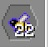

You have collected a lot of Drones of an Ignoble Stock species, but suddenly the
genetic line died off and you're left without a Princess. Or perhaps you have
plenty of spare Drones of a species or you have a spare Princess of another species you don't need. What do you do?
 
Brute Force Mutating is the act of putting a lot of purebred Drones into the Drone slot of an Apiary and a different Princess in the upper slot. Dominant/Recessive genes aside, you will have a 50/ 50 chance of a given trait to be the same as the Drone. By continuing to put the resulting Princess to breed with the mass of Drones, you will eventually come out with a Princess that is exactly the same as the Drones.

A good way of telling if a Princess is ready is when the Drones that are produced start to stack with each other. If all the Drones produced will stack with the Drones in the breeding slot, it's a fairly good chance the Princess has the exact same stats too. Double check with the Portable Analyzer to confirm that this is the case. If not, then it shouldn't take too long before the Princess is purebred too.

Being able to stack Drones is a good sign, you will want to be able to breed a good Drone and then get stacks of that Drone, this makes automation a lot easier.