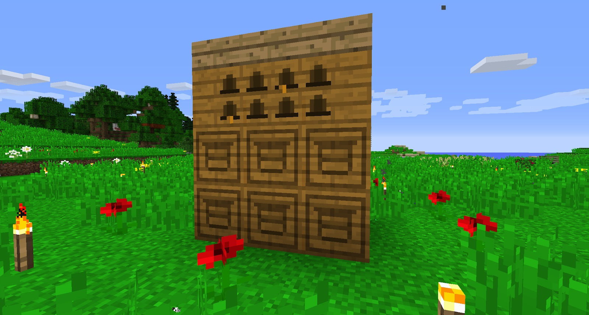

Before you craft your Alveary, you need to find out what you will be using your first Alveary for, and what other Alvearies you want or need to make. It’s best to make a few more Alvearies as soon as possible. You want to make an Alveary that will give the most byproduct gain.

>>>>> The Alveary is a 3x3x4 structure, with the top blocks being slabs and the blocks below being Alveary blocks. The blocks below the Slabs MUST be Alveary Block or the structure will not work. These can’t be built next to each other and will not share blocks.

The best setup for a high output Alveary is:

* 9 Slabs
* 21 alveary Blocks
* 6 Frame Housings

The Frame House will allow you to use Frames inside the Alveary. Instead of the default 3 in the Averay we can store up to 6. Any more then 6 would be a waste of frames.

