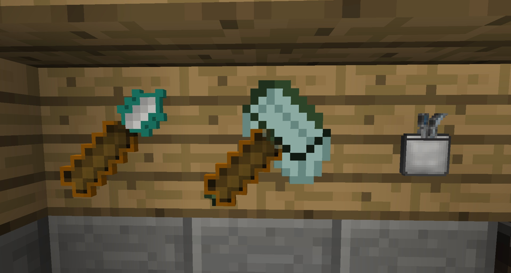

Gendustry adds some tools which make collecting bees (saplings and pollen) easier:

* Industrial Grafter - Like a normal grafter but has an AOE. Can be charged and has 200 uses.
* Scooporator MX200 Turbo - has 500 uses and can be recharged.
* Pollen Collection Kit - Single use; collects pollen from any tree.

