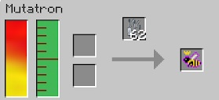

The Mutatron requires power, Mutagen and Labware. Once you have these in the machine you can insert 2 bees (a Princess and a Drone) that you wish to Mutate. The machine will then mutate these bees and give you a mutation (depending what's available with those 2 bees). 

The problem with the normal Mutatron is that you will get a random mutation. You will not know what you will get until the process has finished. This could prove wasteful, and since you want to make this process as pain free as possible, it does not seem practical to rely on luck.

The Advanced Mutatron, on the other hand, does the same thing, but will allow you to see what mutations are possible, and let you choose which mutation you wish to breed. You can't use bees that don’t have a valid breeding option.

By inserting two breedable bees, and selecting your desired queen, you can quickly breed the bee you want. No waiting necessary. This machine has a 100% mutation rate, **BUT sometimes, the bee will die and you will get nothing in return. Do not mutate a new bee without making sure you can recoup the potential loss**. This also works for Trees and butterflies.

