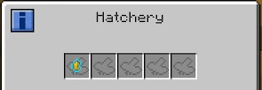

In order to move forward with this mod, you have to build an Alveary because you can’t inoculate queens, Drones or Princesses. The only way to get these Larvae is via the Hatchery block that can be used in an Alveary. 

You will get these Larvae quite quickly, so there is no need to rush getting stacks and stacks of them.