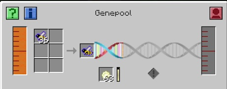

The Genepool takes excess Drones, Ethanol and Enzyme, and converts them into liquid DNA (I am sure you have seen people stockpile this in the past on other servers).

Use excess Drones you have. It does not matter what they are since they are just being used for DNA.

Now you have a source of Liquid DNA. You need to put it into the Polymeriser, along with Polymerising Bacteria. Once you have these, insert your Serum Array. This process is also long, and will run though over and over again until all the vials are full of DNA (I had 13 so it will do 13 passes). This process can be sped up by inserting gold nuggets.
